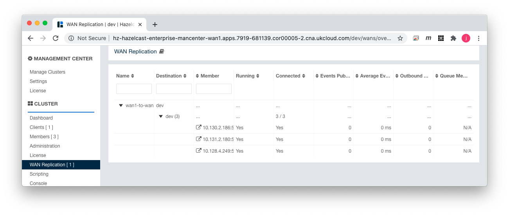
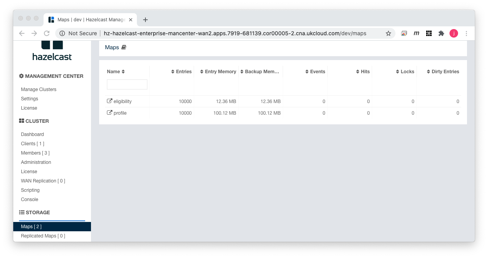

# Hazelcast OpenShift Operator WAN Replication

This bundle demonstrates the Hazelcast WAN topology by replicating data between two (2) Hazlecast clusters running on OpenShift.

## Installing Bundle

```bash
install_bundle -download bundle-hazelcast-4-k8s-oc_wan
```

## Use Case

This bundle installs PadoGrid and Hazelcast containers in two separate projects with WAN replication enabled. As shown in the diagram below, PadoGrid is used to ingest data into the first cluster named **wan1** which in turn publishes data to the second cluster named **wan2**. It includes scripts for starting and stopping containers per project.


## Required Software

- PadoGrid 0.9.3-SNAPSHOT+ (09/03/2020)
- OpenShift Client, **oc**

:exclamation: This bundle depends on `redhat/openshift-ovs-networkpolicy`, to create **NetworkPolicy** objects for enabling communications between projects. Please see [1] and [2] for details.

## Directory Tree View

```console
oc_wan/
├── bin_sh
│   ├── build_app
│   ├── cleanup
│   ├── init_cluster
│   ├── init_wan1
│   ├── login_padogrid_pod
│   ├── setenv.sh
│   ├── show_hazelcast_ips
│   ├── start_hazelcast
│   ├── start_padogrid
│   ├── stop_hazelcast
│   └── stop_padogrid
└── templates
    ├── cluster
    ├── common
    ├── wan1
    └── wan2
```

## 1. Create Projects

This bundle requires two (2) OpenShift projects. It is preconfigured with the project names, **wan1** and **wan2**. You can change the project names in the `setenv.sh` file as follows.

```bash
cd_k8s oc_wan; cd bin_sh
vi setenv.sh
```

Enter your project names in `setenv.sh`.

```bash
...
export PROJECT_WAN1="wan1"
export PROJECT_WAN2="wan2"
...
```

Source in the `setenv.sh` file.

```bash
cd_k8s oc_wan; cd bin_sh
. ./setenv.sh
```

Create OpenShift projects.

```bash
oc new-project $PROJECT_WAN1
oc new-project $PROJECT_WAN2
```

## 2. CRC Users: Create Mountable Persistent Volumes in Master Node

**If you are connected to OCP then you can skip this section.**

If you are logged onto CRC running on your local PC instead of OpenShift Container Platform (OCP), then we need to create additional persistent volumes using **hostPath** for PadoGrid. Let’s create these volumes in the master node as follows.

```bash
# Login to the master node
ssh -i ~/.crc/machines/crc/id_rsa core@$(crc ip)

# Create hostPath volumes. We only need one but let's create two (2)
# in case you want to run addional pods.
sudo mkdir -p /mnt/vol1
sudo mkdir -p /mnt/vol2
sudo chmod -R 777 /mnt/vol1
sudo chmod -R 777 /mnt/vol2
sudo chcon -R -t svirt_sandbox_file_t /mnt/vol1 /mnt/vol2
sudo restorecon -R /mnt/vol1 /mnt/vol2
exit
```

We will use the volumes created as follows:

| Container     | CDC File               | Container Path           | Volume Path |
| ------------- | ---------------------- | ------------------------ | ----------- |
| PadoGrid      | padogrid/padogrid.yaml | /opt/padogrid/workspaces | /mnt/vol?   |

We can now create the required persistent volumes using **hostPath** by executing the following.

```bash
cd_k8s oc_operator; cd padogrid
oc create -f pv-hostPath.yaml
```

## 3. Build Local Environment

Run `build_app` to intialize your local environment.

```bash
cd_k8s oc_wan; cd bin_sh
./build_app
```

The `build_app` script performs the following:

- Creates`cluster`, `wan1`, and `wan2` directories containing OpenShift configuration files.
- Updates `secret.yaml` with the encrypted Hazelcast license key.

## 4. Add User to `anyuid` SCC (Security Context Constraints)

PadoGrid runs as a non-root user that requires read/write permissions to the persistent volume. Let's add your project's default user to the anyuid SCC.

```bash
oc edit scc anyuid
anyuid SCC:
```

Add your project under the `users:` section. For example, if your projects are `wan1` and `wan2` then add the following line.

```yaml
users:
- system:serviceaccount:wan1:default
- system:serviceaccount:wan2:default
```

## 5. Initialize OpenShift Cluster

We need to setup cluster-level objects to enable project-to-project communications. The `init_cluster` script is provided to accomplish the following:

- Create **NetworkPolicy** Objects for both projects
- Apply **CustomResourceDefintion** for Hazelcast Operator
- Apply **ClusterRole** for Hazelcast Operator and Hazelcast

```bash
cd_k8s oc_wan; cd bin_sh
./init_cluster
```

You can view the **NetworkPolicy** objects as follows.

```bash
# Verify the cluster has 'ovs-networkpolicy'
oc get clusternetwork

# List NetworkPolicy objects in the current project
oc get netpol

# Display detailed information on the named NetworkPolicy object
oc describe netpol <name>

# Display ywam output of the named NetworkPolicy object
oc get netpol <name> -o yaml
```

:pencil2: NetworkPolicy is project scoped such that it will be deleted when the project is deleted.

## 6.1. Launch Hazelcast in `$PROJECT_WAN2`

Launch the Hazelcast cluster in the `$PROJECT_WAN2` project first. Since Hazelcast currently does not provide the WAN discovery service, we must first start the target cluster and get its member cluster IP addresses.

```bash
cd_k8s oc_wan; cd bin_sh
./start_hazelcast wan2
```

Wait till the `$PROJECT_WAN2` cluster has all **three (3)** pods running. You can run the `show_member_ips` script as follows.

```bash
watch ./show_hazelcast_ips wan2
```

Output:

```console
Project: wan2
    Arg: wan2

Hazelcast Cluster IP Addresses Determined:

       10.128.4.170:5701
       10.131.2.155:5701
       10.130.2.161:5701

Service DNS: hz-hazelcast-enterprise.wan2.svc.cluster.local
```

## 6.2. Launch Hazelcast in `$PROJECT_WAN1`

Once `$PROJECT_WAN2` cluster has all the Hazelcast members running, run the `init_wan1` script to intialize the Hazelcast configuration files for the `$PROJECT_WAN1` project. The `init_wan1` script updates the `wan1/hazelcast/hazelcast.yaml` file with the `$PROJECT_WAN2` Hazelcast IP addresses for the WAN publisher.

```bash
cd_k8s oc_wan; cd bin_sh
./init_wan1
```

Now, launch the Hazelcast cluster in the `$PROJECT_WAN1` project.

```bash
cd_k8s oc_wan; cd bin_sh
./start_hazelcast wan1
```

## 7. Create Routes

View services:

```bash
# Display services
oc get --namespace=$PROJECT_WAN1 svc
oc get --namespace=$PROJECT_WAN2 svc
```

Output:

`$PROJECT_WAN1`

```console
NAME                                    TYPE           CLUSTER-IP      EXTERNAL-IP   PORT(S)                        AGE
hazelcast-enterprise-operator-metrics   ClusterIP      172.30.0.85     <none>        8383/TCP,8686/TCP              2m16s
hz-hazelcast-enterprise                 ClusterIP      None            <none>        5701/TCP                       2m7s
hz-hazelcast-enterprise-mancenter       LoadBalancer   172.30.202.98   <pending>     8080:30994/TCP,443:32084/TCP   2m7s
```

`$PROJECT_WAN2`

```console
NAME                                    TYPE           CLUSTER-IP       EXTERNAL-IP   PORT(S)                        AGE
hazelcast-enterprise-operator-metrics   ClusterIP      172.30.192.209   <none>        8383/TCP,8686/TCP              19m
hz-hazelcast-enterprise                 ClusterIP      None             <none>        5701/TCP                       19m
hz-hazelcast-enterprise-mancenter       LoadBalancer   172.30.42.245    <pending>     8080:30495/TCP,443:30822/TCP   19m
```

Create routes:

```bash
oc expose --namespace=$PROJECT_WAN1 svc hz-hazelcast-enterprise-mancenter
oc expose --namespace=$PROJECT_WAN2 svc hz-hazelcast-enterprise-mancenter
```

View routes:

```bash
oc get route --namespace=$PROJECT_WAN1
oc get route --namespace=$PROJECT_WAN2
```

Output:

`$PROJECT_WAN1`

```console
NAME                                HOST/PORT                                                                            PATH   SERVICES                            PORT   TERMINATION   WILDCARD
hz-hazelcast-enterprise-mancenter   hz-hazelcast-enterprise-mancenter-wan1.apps.7919-681139.cor00005-2.cna.ukcloud.com          hz-hazelcast-enterprise-mancenter   http                 None
```

`$PROJECT_WAN2`

```console
NAME                                HOST/PORT                                                                            PATH   SERVICES                            PORT   TERMINATION   WILDCARD
hz-hazelcast-enterprise-mancenter   hz-hazelcast-enterprise-mancenter-wan2.apps.7919-681139.cor00005-2.cna.ukcloud.com          hz-hazelcast-enterprise-mancenter   http                 None
```

Management Center URLs:

Use your HOST/PORT names to form the Managemen Center URLs. For our example above, the Management Center URLs are as follows:

WAN1: http://hz-hazelcast-enterprise-mancenter-wan1.apps.7919-681139.cor00005-2.cna.ukcloud.com

WAN2: http://hz-hazelcast-enterprise-mancenter-wan2.apps.7919-681139.cor00005-2.cna.ukcloud.com

### Monitor WAN Replication

Open the browser with both Mangement Center URLs and login using the user name `admin` and the password of your choice. Place the brower windows side by side and monitor the WAN replication activities. The following figures show the Management Center views after we have ingested data in [Section 9](#9-ingest-data-to-project_wan1).

**WAN1 Management Center**



**WAN2 Management Center**



## 8. Start PadoGrid

Start PadoGrid in the `$PROJECT_WAN1` project. We will use PadoGrid to ingest data into the **wan1** cluster, which in turn will replicate the data to the **wan2** cluster. 

### CRC Users

```bash
cd_k8s oc_wan; cd bin_sh
./start_padogrid wan1 local-storage
```

### OCP Users

```bash
cd_k8s oc_wan; cd bin_sh
./start_padogrid wan1
```

## 9. Ingest Data to `$PROJECT_WAN1`

Login to the PadoGrid pod in the first project, i.e., `$PROJECT_WAN1`.

```bash
cd_k8s oc_wan; cd bin_sh
oc project $PROJECT_WAN1
./login_padogrid_pod
```

Create the `perf_test` app and edit `hazelcast-client.xml` from the PadoGrid pod.

```bash
create_app
cd_app perf_test
vi etc/hazelcast-client.xml
```

Replace the `<cluster-members>` element with the following `<kubernetes>` element in the `etc/hazelcast-client.xml` file. We form the service DNS with the service, `hz-hazelcast-enterprise`, and the project, `wan1` following the Kubernetes naming conventions. This will connect `perf_test` to the Hazelcast cluster running in the `wan1` project. Make sure to replace `wan1` with your first project name, i.e., $PROJECT_WAN1.

```xml
                <kubernetes enabled="true">
                        <service-dns>hz-hazelcast-enterprise.wan1.svc.cluster.local</service-dns>
                </kubernetes>
```

### Eligibility and Profile

Ingest eligibility and profile blobs into Hazelcast in `$PROJECT_WAN1`.

```bash
cd_app perf_test; cd bin_sh
./test_ingestion -run
```

Read ingested eligibility and profile blobs from Hazelcast in `$PROJECT_WAN1`.

```bash
cd_app perf_test; cd bin_sh
./read_cache eligibility
./read_cache profile
```

### Customer and Order

If you want to ingest additional data that are not blobs, then first build the `perf_test` and run `test_group` as shown below.

Ingest customers and orders into Hazelcast in `$PROJECT_WAN1`.

```bash
cd_app perf_test; cd bin_sh
./build_app
./test_group -run -prop ../etc/group-factory.properties
```

Read ingested customers and orders from Hazelcast in `$PROJECT_WAN1`.

```bash
cd_app perf_test; cd bin_sh
./read_cache nw/customers
./read_cache nw/orders
```

Exit from the PadoGrid pod.

```bash
exit
```

## Teardown

:exclamation:! The cleanup script may hang due to a known customer resource finalizer issue [3]. If it hangs, then Ctrl+C and run it again. The `cleanp` script remove the CRD finalizers before deleting the CRD but you might need to run it twice to overcome the hanging issue.

```bash
cd_k8s oc_wan; cd bin_sh

# Cleanup all. Run it again if it hangs.
./cleanup -all

# Delete projects
oc delete $PROJENCT_WAN1
oc delete $PROJENCT_WAN2
```

## References

1. How to use NetworkPolicy objects to connect services between projects, https://docs.ukcloud.com/articles/openshift/oshift-how-use-netpol.html
2. Network Polices, https://kubernetes.io/docs/concepts/services-networking/network-policies/
3. Custom resources with finalizers can "deadlock" customresourcecleanup.apiextensions.k8s.io finalizer #60538, https://github.com/kubernetes/kubernetes/issues/60538
